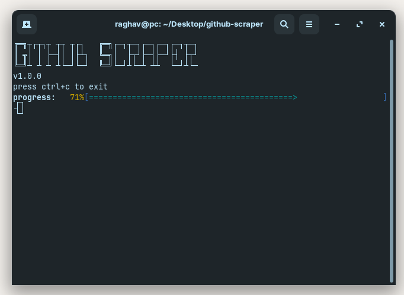
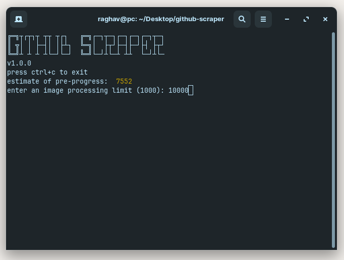

## github scraper

taking user pfps from github api and uses tenserflow js to classify them.

```bash
sh setup.sh
# or just make 3 folders
# - github
# - face
# - notface
npm run start [limit]
# limit is how many images you want downloaded
```



